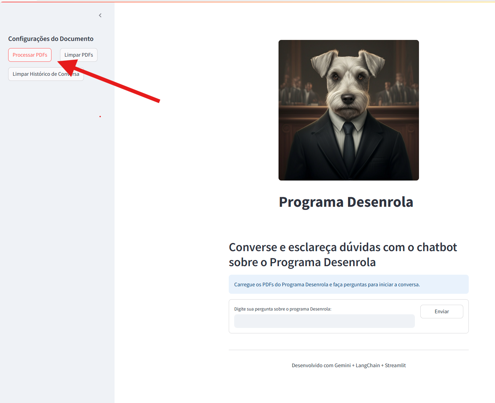
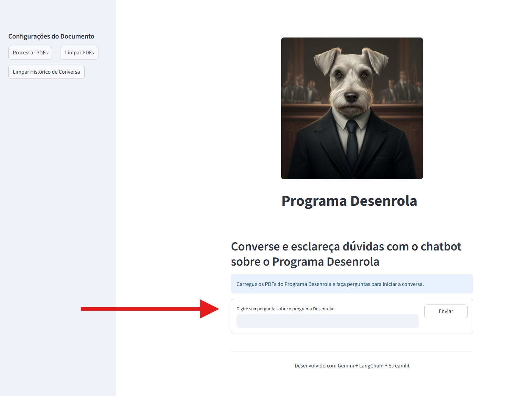

# Chatbot Programa Desenrola da PGF/AGU

<div align="center">
    
</div>

## Sobre o Projeto

Este chatbot foi desenvolvido para ajudar devedores a obterem informações sobre o Programa Desenrola, uma iniciativa do Governo Federal para facilitar a renegociação de dívidas de autarquias e fundações públicas federais (como IBAMA, INMETRO, ANTT, ANS, DNIT, entre outros), no âmbito da Procuradoria-Geral Federal/AGU. O programa prevê, no art. 22 da Lei n. 14.973/2024, a transação extraordinária, que concede ao devedor condições mais favoráveis para quitar os seus débitos não tributários, como multas, por exemplo.

O programa de renegociação de dívidas foi regulamentado pela Lei n. 14.973/2024, e outras normas infralegais, que dispõem sobre aspectos mais específicos da implementação e disponibilização do programa. O público-alvo é composto pelas pessoas (físicas e jurídicas) que detêm dívidas não tributárias perante as autarquias e as fundações públicas federais. 

O programa foi instituído recentemente (a Lei n. 14.973/2024 passou a vigorar em 16 de setembro de 2024), razão pela qual os modelos de Large Language Models (LLM), a depender da base de dados pelas quais foram alimentados, podem não ter as informações necessárias para guiar o usuário do chatbot. Dessa forma, o chatbot utiliza em conjunto com um modelo de LLM, a técnica denominada Retrival-Augmented Generation (RAG). 

O RAG, em suma, decompõe os documentos fornecidos em blocos (chunks), que são vetorizados (embbedings), fazendo com que haja um índice que vincula o vetor ao bloco de documento. Com isso, o prompt a ser passado para o modelo LLM, contém alem da pergunta do usuário, o histórico das perguntas/respostas e alguns desses blocos de documentos. Esses blocos são selecionados de acordo com a indexação capturada pela pergunta do usuário.

O projeto está disponível no repositório Github: https://github.com/joaoleao83/streamlit_chatbot_AGU.git.

## Funcionalidades

- 📄 Processamento automático de documentos em formato PDF relacionados ao Programa Desenrola
- 🤖 Resposta a perguntas específicas sobre o programa, baseadas no conteúdo dos documentos
- 💬 Interface de chat interativa e amigável
- 🔄 Histórico de conversas durante a sessão
- 🧠 Recuperação de informações contextualmente relevantes

## Metodologia

O Chatbot foi desenvolvido a partir das ferramentas/bibliotecas Google Gemini, Langchain e Streamlit. O aplicativo utiliza a tecnologia Gemini da Google em conjunto com LangChain para processar documentos PDF e responder perguntas dos usuários com base no conteúdo desses documentos. A interface do usuário (frontend) é desenvolvida a partir da Streamlit.

O projeto tomou como base o exemplo fornecido pela empresa Edureka!, no vídeo educacional disponibilizado no endereço  eletrônico https://youtu.be/FjUx4Wm3UxY, como também os exemplos de código fornecidos durante as aulas da disciplina Inteligência Artificial Generativa no contexto da Administração Pública, do curso MBA em Ciência de Dados e Inteligência Artifical Aplicadas (ENAP), ministrada pelo Professor Dr. Hélio Bomfim de Macêdo Filho.

Também se utilizou o apoio do LLM Claude 3.7 Sonnet na geração e correção do código, durante o desenvolvimento do projeto. Alguns aspectos importantes do projeto são descritos a seguir.

### Incialização e configuração do modelo LLM

A função ChatGoogleGenerativeAI(model="gemini-2.5-pro-preview-03-25", google_api_key=GOOGLE_API_KEY) é chamada para definir qual é o LLM a ser utilizado.

A função ChatPromptTemplate.from_template, por sua vez, é chamada para configurar o template do prompt. O template se inicia com instruções do sistema, seguido pela tag de contexto, a tag histórico do chat e, por fm, a tag da entrada do usuário. A seguir está discriminado o prompt.

prompt: """
Você é um Procurador Federal, que é um advogado representante de Autarquias e Fundações Públicas Federais, e está ajudando um devedor desses órgãos governamentais a negociar as dívidas.
Você deve responder às perguntas do devedor com base no contexto fornecidos.
Certifique-se de que sua resposta seja relevante para o contexto.
Se não souber a resposta, diga "Não encontrei essa informação nos documentos. Poderia reformular sua pergunta de forma mais específica, com exemplos se possível?".

\<contexto\>
{context}
\</contexto\>

Histórico do chat:
{chat_history}

Pergunta atual:
{input}
"""

### função para localizar os pdfs

A função load_pdfs_from_directory é desenvolvida para possibilitar a localização de todos os documentos em PDF que estejam em um determinado diretório (no caso o diretório Programa_Desenrola).

### função para transformar os pdf em embeddings

Para o processamento dos pdf, são gerados os embeddings a partir da chamada da função GoogleGenerativeAIEmbeddings, selecionando o modelo embedding-001.

Os documentos são divididos em blocos (chunks) pela função RecursiveCharacterTextSplitter, passando os argumentos da função chunck_sike=1000 e chunck_overlap=200. O parâmetro chunk_size define o número máxima de caracteres que o bloco pode conter e chunck_overlap define a quantidade de caracteres que vão estar sobrepostos de um bloco para outro, para não haja perda de contexto.

Os vetores, por fim, são criados com a utilização da biblioteca FAISS, chamando a função from_documentos, passando como argumentos os chunks e o modelo de processamento de embedding.

Os vetores, por fim, são armazenados temporariamente na sessão do streamlit ("session state"), pelo atributo st.session_state.vectors.

### histório do chat

O histório do chat é armazenado na sessão do streamlit, utilizando o atributo st.session_state.chat_history, de modo que é exibido ao usuário a cada consulta, além de ser passado para incrementar o prompt em cada pergunta feita pelo usuáiro.

### invocação da cadeira de recuperação (retrieval chain)

Primeiramente, é extraído o histórico do chat para a configuração do prompt, passando também a pergunta atual do usuário.

Cria uma cadeia de recuperação de documentos relevantes, buscando os 5 documentos mais relevantes (search_kwargs={"k": 5"}), chamando a função create_retrieval_chain da biblioteca Langchain. Após aciona o retrieval chain, chamando a função invoke, passando como argumentos o histório do chat e a pergunta atual do usuário.

Adiciona a resposta trazida pelo modelo para o histórico, de modo que o histórico é repassado novamente ao usuário, após "forçar" a reinicialização do aplicativo, para atualizar a interface do usuário.

### implantação

O aplicativo está armazenado em um repositório do Github: https://github.com/joaoleao83/streamlit_chatbot_AGU.git, sendo implatado na Streamlit Community Cloud.

## Funcionamento

1. Inicie o aplicativo acessando o endereço eletrônico https://appchatbotagu.streamlit.app/.
2. Clique em "Processar PDFs" na barra lateral para carregar os documentos
3. Digite suas perguntas sobre o Programa Desenrola na caixa de texto
4. Receba respostas baseadas no conteúdo dos documentos carregados

Para utilização do chatbot, primeiramente, é necessário acionar o botão "Processar PDFs" que se encontra na barra lateral, no lado esquerdo da interface do usuário, conforme demonstrado na imagem a seguir.

<div align="center">
    
    <p><em>Figura 1: Botão para processamento dos PDFs</em></p>
</div>

Uma vez processados os PDFs, você pode começar a fazer perguntas no campo de texto localizado na parte inferior da interface, como mostrado na imagem abaixo:

<div align="center">
    
    <p><em>Figura 2: Interface de perguntas e respostas</em></p>
</div>

## Estrutura do Projeto

```
streamlit_chatbot_AGU/
│
├── main_streamlit_chatbot.py    # Aplicativo principal Streamlit
├── gemini-native-image.png      # Logo/imagem usada na interface
├── imagens/                     # Diretório com imagens para documentação
│   ├── processar_pdf.png        # Captura de tela do botão de processamento
│   └── pergunta_resposta.png    # Captura de tela da interface de chat
├── requirements.txt             # Dependências do projeto
├── .env                         # Arquivo de variáveis de ambiente (não incluído no git)
├── README.md                    # Documentação do projeto
└── Programa_Desenrola/          # Pasta contendo os PDFs a serem processados
    └── *.pdf                    # Documentos PDF do programa
```
## Tecnologias Utilizadas

- [Streamlit](https://streamlit.io/) - Framework para construção da interface
- [LangChain](https://www.langchain.com/) - Framework para processamento de linguagem natural
- [Google Gemini AI](https://ai.google.dev/gemini) - Modelo de linguagem
- [FAISS](https://github.com/facebookresearch/faiss) - Biblioteca para pesquisa de vetores

## Limitações Conhecidas

- O chatbot responde apenas com base nas informações presentes nos documentos carregados
- Pode haver ocasionais erros de interpretação em perguntas muito complexas ou ambíguas

## Resultados

O chatbot consegue responder a contento as perguntas realizadas pelos usuários, para dirimir dúvidas e esclarecer situações sobre o programa Desenrola da Procuradoria-Geral Federal/AGU. Caso fosse disponibilizado publicamente pela instituição, ajudaria bastante os usuários a sanar dúvidas pontuais, sem precisar recorrer à leitura de extensas normas, nem mesmo à ajuda de algum servidor público especializado para tanto.

Dessa forma, haveria possivelmente maior aderência ao programa por parte dos usuários, com a melhor orientação sobre a adesão e o esclarecimento das dúvidas surgidas, assim como haveria economia à administração pública, por prescindir a utilização de algum servidor para realizar tal mister, gerando, pois, ganho na qualidade do serviço prestado e eficiência.

## Contato

Para questões, sugestões ou contribuições, entre em contato através do GitHub ou pelo email: joaoleao83@gmail.com
